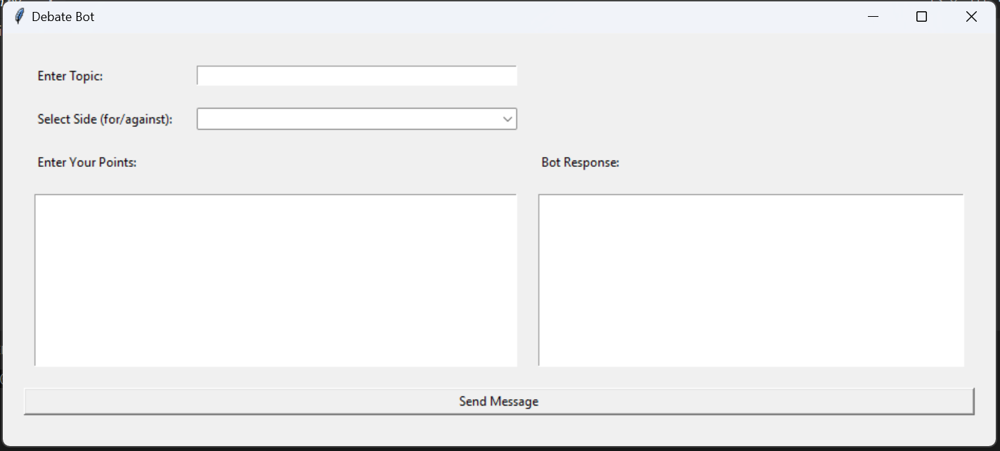
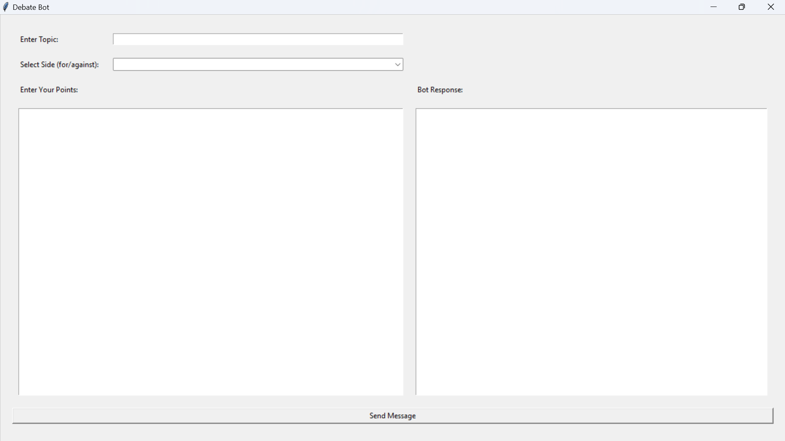
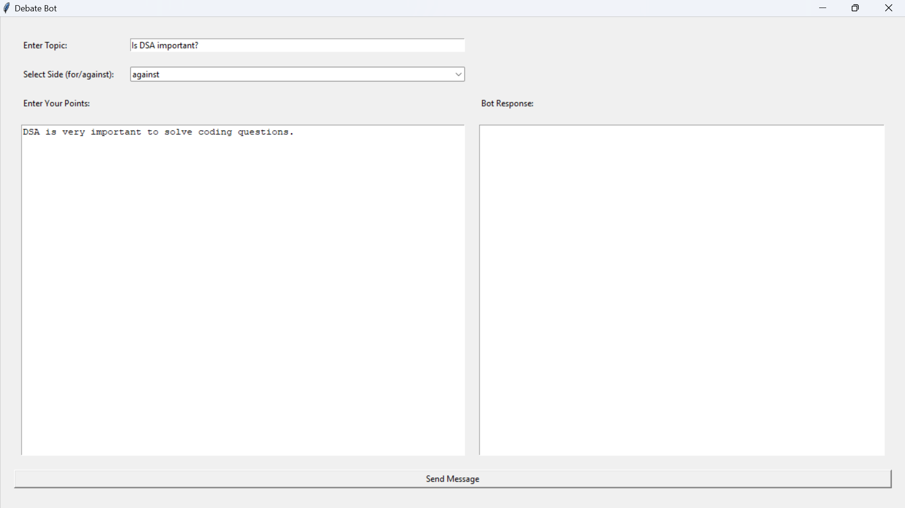
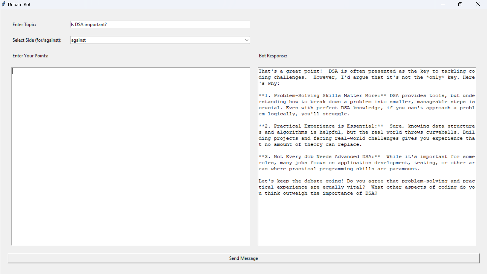
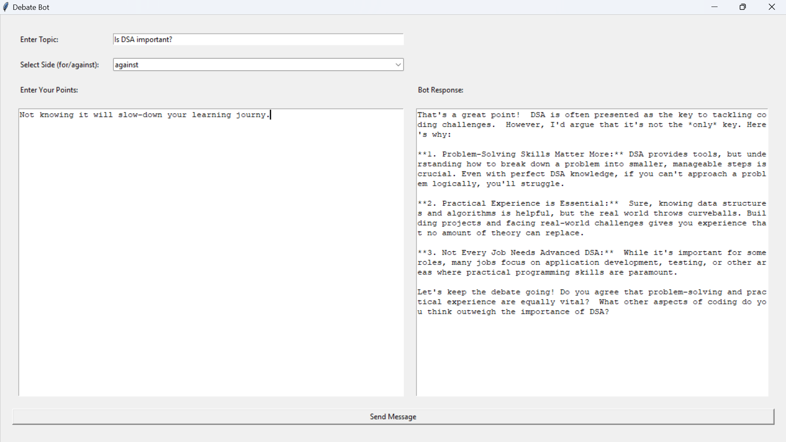
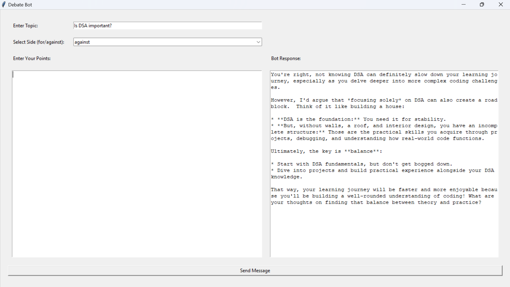

# AI Debate Bot

This is a AI powered chat bot specifically to practice debates. You can specify the topic and the for/against for the bot and the bot will response accordingly. This project used Google Gemini to generate the response to the user arguments.

NOTE: You can find a openai_connect.py file in the project which may seem to be useless. This is because the project was prior build using OpenAI but was then shifted to Google Gemini. You can refer the OpenAI API code if required.

## Table of Contents

- [Installation](#installation)
- [Usage](#usage)
- [Screenshots](#screenshots)
- [Contributing](#contributing)
- [License](#license)

## Installation

Instructions on how to install and set up the project.

```bash
# Clone the repository
git clone https://github.com/mrz004/debate_bot_pyp.git

# Navigate to the project directory
cd debate_bot_pyp

# Install dependencies
pip install requirements.txt
```

## Usage

Instructions on how to use the project.

1. First get your Gemini API key for [here](https://aistudio.google.com/)

1. Create a file named `.apikey`

1. Past your api key in `.apikey`

```bash
# Run the project
python main.py
```

## Screenshots

### Initial look



### Full screen look



### Prompt 1



### Response 1



### Prompt 2



### Response 2



## Contributing

Guidelines for contributing to the project.

1. Fork the repository.
2. Create a new branch (`git checkout -b feature-branch`).
3. Make your changes.
4. Commit your changes (`git commit -m 'Add some feature'`).
5. Push to the branch (`git push origin feature-branch`).
6. Open a pull request.
